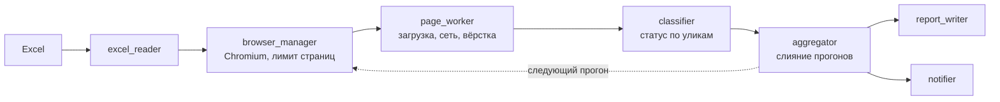
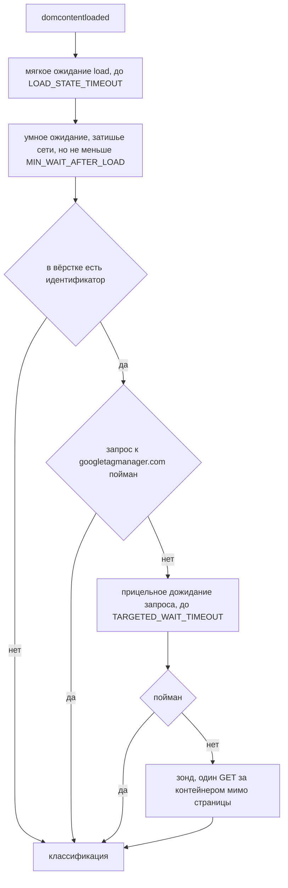
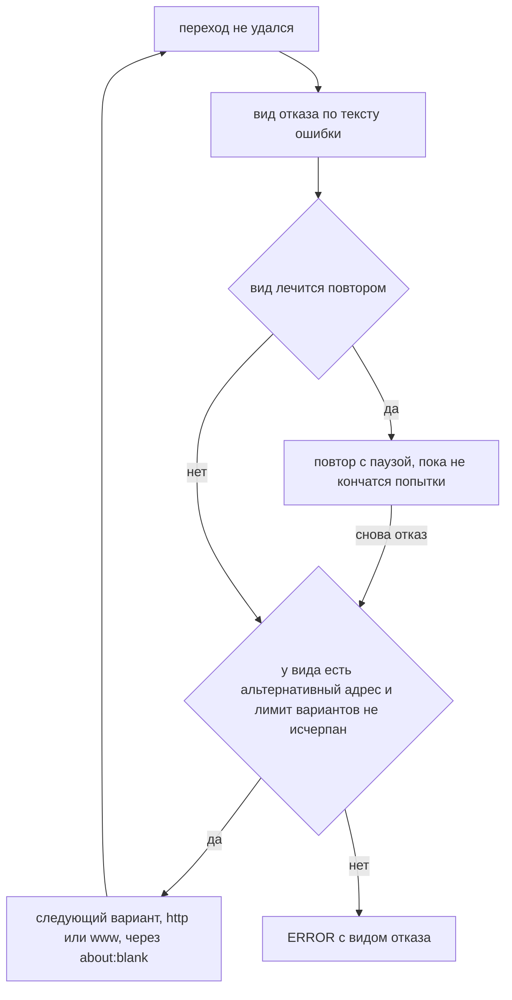

# Google Page Checker: как это устроено

Массовая проверка сайтов на Google Analytics и Google Tag Manager. Читает
список адресов из Excel, открывает каждый сайт в headless-Chromium через
Playwright, слушает сетевые запросы, разбирает готовую вёрстку и присваивает
сайту статус. На выходе два текстовых отчёта и, если настроен вебхук,
сообщение в Mattermost.

Этот документ про то, как чекер принимает решения и почему именно так.
Короткое описание проекта и команды запуска лежат в [README проекта](../README.md).

## 1. Конвейер



`excel_reader` достаёт адреса, `browser_manager` держит Chromium и не даёт
открыть больше N страниц разом, `page_worker` грузит страницу и собирает
признаки, `classifier` превращает признаки в статус, `aggregator` сливает
несколько прогонов в один результат, дальше отчёты и отправка.

### Признаки, по которым принимается решение

Их три, и они разной силы.

Первый и самый убедительный: collect-хиты. Это настоящие обращения к серверу
аналитики, адреса вида `/collect`, `/g/collect`, `/j/collect`, `/mp/collect`,
`/batch`. Чекер ловит сам факт отправки на событии request, не дожидаясь
ответа: попытка отправить хит уже означает, что счётчик работает, даже если
ответ не пришёл.

Второй: идентификатор установки в готовом DOM. Это `GTM-XXXX`, `G-XXXX`
в `gtag/js?id=` или в вызове `gtag('config', ...)`, `UA-XXXX-X`. Такой
идентификатор владелец вставляет сам, случайно он на странице не появляется.

Третий, самый слабый: телеметрия ошибок, запросы с `t=error&_e=exc`.
Библиотека GA загрузилась, запустилась и сломалась. Установка есть, но что
с ней происходит, по одному этому признаку не понять.

Отдельно чекер считает слабые маркеры: упоминания GA без идентификатора, вроде
голого `gtag(` или ссылки на библиотеку. Установкой они не считаются. Такие
строки почти всегда принадлежат чужим скриптам: счётчикам, баннерам согласия,
чатам, интеграциям в духе "если на странице есть gtag, продублируй событие".

## 2. Навигация и ожидание

Переход считается состоявшимся по событию `domcontentloaded`, а событие `load`
дожидается отдельно и мягко, в пределах `LOAD_STATE_TIMEOUT`.

Раньше навигация ждала `load` целиком, и тяжёлые сайты в таймаут не
укладывались. Страница уходила в ERROR, хотя вёрстка давно была получена.
В боевом логе на это приходилось больше 600 отказов за прогон.

После загрузки у страницы есть три шанса показать аналитику.

**Умное ожидание.** Ждём затишья сети, до `NETWORKIDLE_TIMEOUT`, но в любом
случае не меньше `MIN_WAIT_AFTER_LOAD` после `load`. Гарантированный минимум
нужен потому, что часть платформ инжектит внешние скрипты примерно через
три секунды после `load`, когда сеть уже тихая. Один `networkidle` сработал бы
раньше инжекции и ничего бы не увидел.

**Прицельное дожидание.** Если в вёрстке нашёлся идентификатор, а запроса
к `googletagmanager.com` мы ещё не поймали, ждём именно этот запрос, до
`TARGETED_WAIT_TIMEOUT`. Ничего от себя при этом не отправляем.

**Зонд.** Если страница так и не сходила за контейнером, чекер сам делает один
GET на `gtm.js?id=...` через `context.request`, мимо сетевой статистики
страницы. Ответ говорит о состоянии контейнера: 404 или 410 значит удалён,
2xx значит жив, но страница его не запрашивает. Второе обычно означает, что
тег выключен конфигом.

Второй и третий ярусы включаются только при найденном идентификаторе. Сайты
без него и сайты, где запрос уже пойман, не замедляются.



## 3. Несколько прогонов и слияние

Весь список проверяется `RUN_COUNT` раз, по умолчанию четыре. Причина простая:
страничные запросы нестабильны. Сайт, который в первый раз не показал ни
одного обращения к аналитике, во второй раз показывает.

Прогоны сливает `modules/aggregator.py`. По каждому адресу берётся результат
с максимальным рангом улик:

```
4  collect-хиты
3  запрос контейнера со страницы
2  идентификатор установки в вёрстке
1  страница открылась, следов нет
0  ошибка открытия
```

При равных рангах побеждает чистый ответ сервера, а не ответ с кодом ошибки.
При полном равенстве остаётся более ранний прогон, чтобы результат был
воспроизводим. Дубли не выводятся, порядок сохраняется как во входном файле:
отчёт читают рядом с исходным Excel, и перестановка строк мешает сверке.

Ошибкой сайт числится, только если не открылся ни в одном прогоне.

Ранг 2 появился не сразу. До него BROKEN и NONE делили один ранг, а слияние
заменяло результат только при строгом превосходстве. Получалось, что
классификацию по вёрстке фиксировал первый успешный прогон, а все следующие
для таких сайтов просто сгорали. Если в первом прогоне HTML не прочитался,
сайт навсегда оставался в NONE, сколько бы прогонов ни делали.

## 4. Статусы

| Статус | Когда присваивается | Аналитика есть? |
|---|---|---|
| WORKING | есть collect-хиты | да, работает |
| BROKEN | хитов нет, но в вёрстке есть идентификатор | тег есть, данные не идут |
| SUSPICIOUS | только телеметрия ошибок, следов установки нет | нужна ручная проверка |
| NONE | ничего, включая случай одних слабых упоминаний | нет |
| ERROR | страницу не удалось открыть | неизвестно |

### Мёртвые теги Universal Analytics

Google остановил сбор данных в стандартных ресурсах Universal Analytics
1 июля 2023 года, а 1 июля 2024-го удалил сами ресурсы, интерфейс и API.
Тег `UA-XXXXXXX-N` в вёрстке сегодня физически не может ничего отправить.
Это мёртвый код, а не аналитика, которую выключили конфигом.

Такие сайты вынесены в отдельную группу, и на это есть практическая причина.
Зондировать UA-идентификатор бесполезно: `googletagmanager.com` отдаёт
`gtag.js` на любой синтаксически корректный идентификатор, поэтому ответ 200
не доказывает ничего. Раньше из него делался вывод, что контейнер жив,
а страница его не запрашивает. На боевом прогоне это была неверная
формулировка для 90 сайтов из 120.

Теперь UA не зондируется вовсе, и причина BROKEN проставляется по самому факту
UA-идентификатора. Заодно это минус один HTTP-запрос на каждый такой сайт
в каждом прогоне.

Если в вёрстке есть и GTM-контейнер, и UA-тег, разбирается GTM: живая
установка важнее наследия.

## 5. Обработка ошибок

Раньше любая неудача схлопывалась в один ERROR. На боевом списке туда попадало
157 адресов из 372 одной кучей, по которой нельзя было понять, что чинить.
Теперь каждый отказ разбирается по виду, и от вида зависит поведение.

| Вид | Что произошло | Повторять? | Другой адрес |
|---|---|---|---|
| dns | нет записи DNS или домен из другого контура | нет | вариант с www |
| tls | рукопожатие не состоялось, TLS 1.0/1.1 или шифр | нет | http:// |
| timeout | сервер не ответил вовремя | да | http:// |
| refused | соединение отвергнуто или оборвано | да | http://, www |
| redirect_loop | бесконечная цепочка редиректов | нет | http://, www |
| auth_required | требуется HTTP-авторизация | нет | нет |
| proxy | прокси не пропустил соединение | да | нет |
| invalid_url | строка не является адресом | нет | нет |
| browser | сбой Playwright или Chromium | да | нет |

Как вид отказа управляет повторами и сменой адреса:



Долю неоткрытых сайтов снижают три механизма.

**Повторы только там, где они помогают.** Мёртвая запись DNS за паузу
не появится, поэтому три попытки по 45 секунд на такой адрес больше
не тратятся. На боевом списке это 84 адреса, умноженные на три попытки
и паузу между ними, в каждом прогоне.

**Лестница альтернативных адресов.** При отказе, который лечится сменой
адреса, пробуется `http://` вместо `https://` и вариант имени с `www.` или
без него. Всего не больше `_MAX_URL_VARIANTS` разных адресов на сайт. Между
вариантами страница уводится на `about:blank`: без этого Chromium прерывает
следующий переход своей chrome-error-страницей и попытка сгорает впустую.

**Разрешён устаревший TLS.** Chromium запускается с `--ssl-version-min=tls1`,
иначе серверы на TLS 1.0 и 1.1 отвергаются ещё до отправки запроса,
с ошибкой `ERR_SSL_VERSION_OR_CIPHER_MISMATCH`.

### Ответ кодом 400 и выше

Сервер ответил, значит страница существует. Кастомная 404-я или страница
"доступ запрещён" вполне может тащить тот же GTM, что и остальной сайт.
Такие страницы разбираются как обычные и помечаются флагом `http_error`
и кодом ответа. Коды из `HTTP_TRANSIENT_CODES`, то есть 429 и 5xx, сначала
добиваются повторами, остальные разбираются сразу.

Мусорные ячейки Excel вроде "нет" или "уточняется" отсеиваются до браузера.
Такая запись получает вид отказа `invalid_url` и не тратит ни попытки,
ни времени.

## 6. Структура

```
google_page_checker/
  main.py                  точка входа: оркестрация, логи, сводка
  modules/
    config.py              все настройки: пути, паттерны, статусы, Mattermost
    excel_reader.py        чтение адресов из Excel, пропуск пустых, дедуп
    browser_manager.py     Chromium: запуск, stealth, TLS, лимит страниц
    network_listener.py    перехват и разметка запросов к Google
    failures.py            виды отказов, политика повторов
    url_variants.py        нормализация адреса и альтернативные варианты
    page_worker.py         обработка страницы и поиск маркеров в вёрстке
    classifier.py          статус по признакам, чистая функция
    aggregator.py          слияние прогонов, лучший результат без дублей
    report_writer.py       краткий и расширенный отчёты
    notifier.py            отправка в Mattermost
  tests/
    test_logic.py          28 тестов логики, браузер не нужен
    test_e2e_local.py      7 проверок на живом Chromium без интернета
  secrets/                 вебхуки и токены, закрыт gitignore
  data/
    input_urls.xlsx        входной файл, колонка url
    input_urls.example.xlsx  обезличенный образец
  logs/app.log
  requirements.txt
  run.sh                   запуск через xvfb на Linux
```

## 7. Требования и запуск

Нужен Python 3.10 или новее, зависимости из `requirements.txt` и Chromium.
Playwright обязательно 1.55 или выше: на 1.40 был дефект, из-за которого
`Response.request` падал с ошибкой `'dict' object has no attribute '_object'`
и ронял попытку загрузки сайта.

Работает на Linux, где лучше запускать через `xvfb`, и на macOS.

```bash
cd analytics/google_page_checker
python3 -m venv venv
source venv/bin/activate
pip install --upgrade pip
pip install -r requirements.txt
playwright install chromium

export GPC_MATTERMOST_WEBHOOK="адрес Incoming Webhook"   # необязательно

python3 tests/test_logic.py       # логика, около 2 секунд
python3 tests/test_e2e_local.py   # живой Chromium, локальные серверы
python3 main.py
```

Если headless-режим на Linux зависает, запускайте через `xvfb-run -a python3 main.py`.

Входной файл: `data/input_urls.xlsx`, колонка `url`. Адреса без `https://`
допустимы, протокол добавится сам. Рядом лежит `input_urls.example.xlsx`
с обезличенными адресами, на нём можно запустить сразу.

## 8. Отчёты

### Краткий

Лежит в `data/output_summary.txt`, печатается последним блоком в консоли
и уходит в Mattermost. Шапка со счётчиками, список сайтов с работающей
аналитикой и ошибки, разложенные по причинам.

```
=== ОТЧЁТ ПО НАЛИЧИЮ GOOGLE ANALYTICS ===
Всего URL в списке          : 372
Успешно открыто (всего)     : 250
  Google обнаружено         : 7
  Google не обнаружено      : 243
Ошибок (не удалось открыть) : 122
------------------------------------------------------------
--- Google обнаружен ---
https://shop.example.com
  Статус : Google Found
--- Ошибка при открытии ---
  домен не резолвится (нет записи DNS или другой контур) - 84
    https://internal.example.com
  требуются учётные данные (HTTP-авторизация) - 2
    https://closed.example.com
```

В группу "Google обнаружен" попадают только сетевые улики самой страницы:
загрузка контейнера или тега с `googletagmanager.com`, либо collect-хиты.
Улики зонда сюда не выводятся, потому что зонд это запрос чекера, а не
страницы. Состояние контейнера по зонду смотрите в расширенном отчёте.

### Расширенный

Лежит в `data/output_report.txt`. Статистика по всем категориям, сводка по
общим контейнерам, секции по каждому статусу и разбор недоступных сайтов
по видам отказа.

Секция общих контейнеров показывает, где один идентификатор стоит сразу
на нескольких сайтах. В боевом прогоне 24 сайта делили один контейнер,
и в отчёте это выглядело как 24 независимые находки, хотя за ними стоял один
шаблон платформы и одно решение.

```
--- Общие контейнеры: один ID на несколько сайтов (3) ---

  GTM-W9D3BC - сайтов: 24 (BROKEN: 24)
    - https://a.example.com
    - https://b.example.com

--- BROKEN: тег в вёрстке есть, рабочих хитов нет (125) ---

https://broken.example.com
  Google : Found (сетевой запрос со страницы)
  Статус : BROKEN
  Контейнер : GTM-AB12CD
  Маркеры в вёрстке (1):
    - GTM-AB12CD
      контекст: ...'script','dataLayer','GTM-AB12CD');</script>...
  Прочие Google-запросы (1):
    - https://www.googletagmanager.com/gtm.js?id=GTM-AB12CD  [HTTP 404]
  Ответ  : HTTP 404, страница отдана с кодом ошибки, содержимое разобрано
  Открыт : http://broken.example.com (исходный адрес не отвечал)

--- ERROR: не удалось открыть (122) ---

  [dns] домен не резолвится - 84
  что делать: проверить по второму контуру или убрать из списка
    - https://internal.example.com
      Page.goto: net::ERR_NAME_NOT_RESOLVED
      пробовали также: https://www.internal.example.com
```

Пометки в квадратных скобках читаются так: 204 у хитов это норма,
404 у `gtm.js` это мёртвый контейнер, отсутствие пометки означает, что запрос
ушёл, а ответ не пришёл, и факт отправки всё равно учтён. Если улику добывал
зонд, в записи появляется отдельная строка с его результатом.

В шапке расширенного отчёта видно, сколько прогонов объединено, сколько сайтов
разобрано с кодом ошибки и сколько открылось альтернативным адресом.

## 9. Отправка в Mattermost

Краткий отчёт уходит в канал через Incoming Webhook. Адрес вебхука это секрет,
в коде его нет, но и экспортировать руками перед каждым запуском не нужно.
Источники ищутся по порядку: сначала переменная окружения
`GPC_MATTERMOST_WEBHOOK`, потом файл `secrets/mattermost_webhook.txt`, где
берётся первая непустая строка без решётки в начале.

Каталог `secrets/` закрыт gitignore целиком. Если не нашлось ни того, ни
другого, отчёт просто не отправляется, а прогон продолжается штатно.

## 10. Настройки

Все в `modules/config.py`.

| Параметр | По умолчанию | Что делает |
|---|---|---|
| INPUT_FILE | data/input_urls.xlsx | входной Excel |
| OUTPUT_FILE | data/output_report.txt | расширенный отчёт |
| SUMMARY_FILE | data/output_summary.txt | краткий отчёт |
| EXCEL_COLUMN_NAME | url | имя колонки |
| EXCEL_SHEET_NAME | None | None читает все листы, имя или номер один |
| EXCEL_EMPTY_ROW_BREAK | 25 | столько пустых строк подряд считается концом листа |
| BROWSER_HEADLESS | True | фоновый режим |
| BROWSER_SLOW_MO | 0 | задержка на операцию Playwright, мс |
| BLOCK_RESOURCES | False | блокировать картинки, стили, шрифты |
| MAX_CONCURRENT_PAGES | 10 | сколько страниц открыто разом |
| ALLOW_LEGACY_TLS | True | разрешить TLS 1.0 и 1.1 |
| NAV_WAIT_UNTIL | domcontentloaded | по какому событию навигация состоялась |
| PAGE_TIMEOUT | 30000 | таймаут навигации, мс |
| LOAD_STATE_TIMEOUT | 15000 | мягкое дожидание load, мс |
| NETWORKIDLE_TIMEOUT | 15000 | ожидание затишья сети, мс |
| MIN_WAIT_AFTER_LOAD | 4.0 | гарантированный минимум после load, сек |
| TARGETED_WAIT_TIMEOUT | 10000 | прицельное дожидание контейнера, мс |
| PROBE_TIMEOUT | 10000 | таймаут зонда, мс |
| MAX_RETRIES | 3 | повторов, только для транзиентных отказов |
| RETRY_PAUSE | 3.0 | пауза между попытками, сек |
| RUN_COUNT | 4 | полных прогонов списка |
| ANALYZE_HTTP_ERRORS | True | разбирать страницы с кодом 400 и выше |
| HTTP_TRANSIENT_CODES | 429, 5xx | коды, при которых повтор имеет смысл |
| GA_PATTERNS | список | широкая сеть на инфраструктуру Google |
| GA_COLLECT_PATTERNS | список | настоящие хиты аналитики |
| GA_ERROR_MARKERS | t=error, _e=exc | признак телеметрии ошибок |
| HTML_GTM_STRONG_PATTERNS | список | идентификаторы установки |
| HTML_GTM_WEAK_PATTERNS | список | упоминания без идентификатора |
| MATTERMOST_WEBHOOK_URL | из окружения | пусто, значит не отправлять |

### Сколько это занимает

Один прогон 372 адресов при десяти страницах разом укладывался примерно
в 12 минут ещё до правок. Отказ от повторов на детерминированных ошибках
и нулевой `BROWSER_SLOW_MO` этот бюджет сокращают.

`RUN_COUNT = 20` в прошлой конфигурации давал двадцать одинаковых результатов
примерно за четыре часа. Отсюда четыре.

## 11. Тесты

```bash
python3 tests/test_logic.py       # 28 тестов, около 2 секунд
python3 tests/test_e2e_local.py   # 7 проверок на живом Chromium
```

`test_logic.py` покрывает паттерны конфига, включая проверку, что адреса
вебхука в коде нет; классификатор полным перебором; таксономию отказов
и политику повторов; нормализацию адресов и подбор альтернатив; слушатель
сети вместе с устойчивостью к дефекту Playwright 1.40; поиск маркеров
в вёрстке; все сценарии обработки страницы; отказ от повторов на
детерминированных ошибках; лестницу альтернативных адресов; разбор страниц
с кодом 400 и выше; детализацию BROKEN; прицельное дожидание; зонд;
распознавание мёртвых UA-тегов; оба отчёта; группировку по контейнерам;
слияние прогонов; источники вебхука и его отправку; семафор браузера
и аргументы запуска Chromium.

`test_e2e_local.py` поднимает локальные HTTP и HTTPS-серверы и разводит по ним
выдуманные домены через `--host-resolver-rules`. На настоящем Chromium
проверяются разбор 404, добивание 503, фолбэк с https на http, фолбэк на
www-вариант, отсев мусорных строк и корректная маркировка мёртвых доменов.
Интернет не нужен.

## 12. Телеметрия ошибок

Запросы вида `google-analytics.com/u/d?t=error&_e=exc...` это краш-репорты
самой библиотеки GA о своих ошибках, а не хиты. Они фиксируются отдельным
типом и участвуют в классификации: если это единственный признак, сайт
получает статус SUSPICIOUS.

## 13. Валидация адресов

При чтении Excel пропускаются пустые ячейки и дубликаты, а ячейка с
несколькими адресами разбирается на отдельные записи. Строки без домена,
вроде "нет" или "lk b2b", до браузера не доходят: они получают вид отказа
`invalid_url` и попадают в соответствующую группу отчёта.

## 14. Частые ошибки

| Ошибка | Причина | Что делать |
|---|---|---|
| net::ERR_TIMED_OUT | сервер не отвечает или JS-челлендж | увеличить PAGE_TIMEOUT, проверить вручную |
| net::ERR_NAME_NOT_RESOLVED | неверный домен, DNS или другой контур | проверить адрес или прогнать по второму контуру |
| net::ERR_CONNECTION_REFUSED | порт закрыт | проверить сайт вручную |
| net::ERR_SSL_VERSION_OR_CIPHER_MISMATCH | устаревший TLS на сервере | лечится ALLOW_LEGACY_TLS, иначе фолбэк на http |
| net::ERR_INVALID_AUTH_CREDENTIALS | нужна HTTP-авторизация | автоматически не обходится |
| 'dict' object has no attribute '_object' | дефект Playwright 1.40 | обновить до 1.55 или новее |
| SIGSEGV при старте браузера на macOS | старая сборка Chromium | pip install -U playwright, затем playwright install chromium |

## 15. Что стоит знать

Сайты с JS-защитой могут зависать, на Linux помогает `xvfb-run -a`.

Запрос к `googletagmanager.com` сам по себе не означает, что аналитика есть.
Статус определяет классификатор по совокупности признаков.

В лог `logs/app.log` по каждому сайту пишется строка вида
`https://site.example.com: статус=BROKEN, GA=True`, а в конце сводка
по категориям и разбивка недоступных сайтов по видам отказа.
