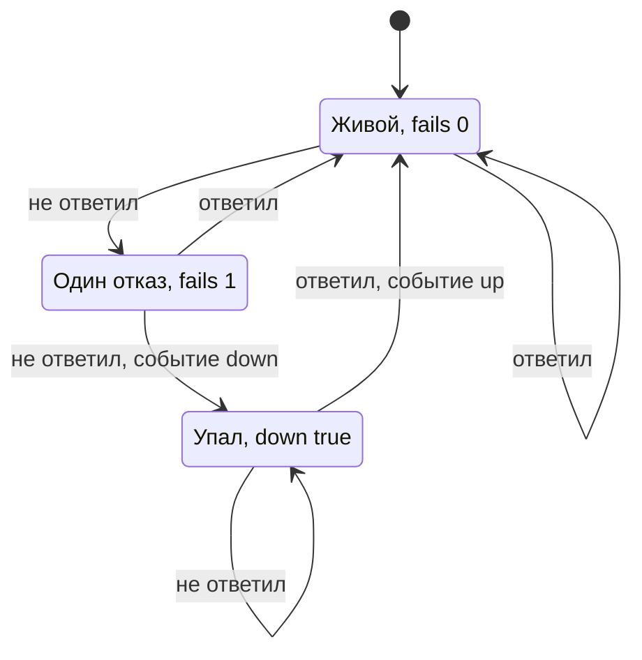
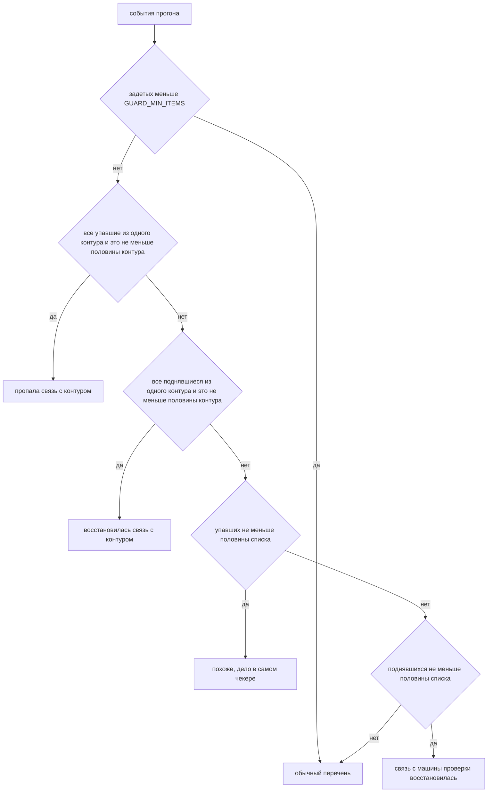

# Код domain_checker: модули и функции

Документ для того, кто открывает проект впервые. Здесь описано, из чего
состоит код, что делает каждая функция и какие данные ходят между ними.
Описание снято с работающего кода 14.09.2026.

Как запускать, настраивать и ставить в расписание - в README.md. Здесь
только устройство.

## Что делает программа

Раз в пять минут обходит список доменов по HTTP и пишет в Mattermost,
когда домен упал или снова отвечает. Живым считается любой ответ с кодом
от 200 до 399, содержимое страницы не разбирается. Падение подтверждается
двумя неудачными прогонами подряд. Сообщение уходит только в момент смены
статуса, поэтому при здоровых доменах канал молчит.

Это скрипт, а не сервис: один запуск делает один прогон и завершается.
Расписание снаружи, в cron или systemd.

## Как устроен один прогон

1. `run.sh` подхватывает переменные из `.env` и запускает `main.py`.
2. `main.py` читает список доменов из Excel (пакет `sources`).
3. Все домены проверяются пулом потоков, по одному HTTP-запросу на домен
   (пакет `probe`).
4. Результаты сравниваются с состоянием прошлого прогона из `data/state.json`.
   Отсюда рождаются события: кто упал, кто поднялся (`alerting/state.py`).
5. Из событий собирается текст сообщения. Если разом легла большая часть
   списка, вместо перечня уходит одна строка про отказ самого чекера
   (`alerting/alert.py`).
6. Текст отправляется в Mattermost (`alerting/notifier.py`), состояние
   сохраняется, скрипт печатает сводку и завершается.
7. Раз в сутки вдобавок уходит короткое сообщение о том, что чекер жив.

Код возврата: 0 - прогон состоялся, 1 - не состоялся или состояние не
сохранилось, 2 - ошибка в аргументах. Если код ненулевой, `run.sh` сам
отправляет в канал сообщение об этом через `tools/notify.py`.

## Файлы

```
run.sh                  обёртка для расписания
main.py                 точка входа: аргументы, цикл прогона, код возврата
modules/
  config.py             все настройки и московское время
  urls.py               нормализация адреса и отсев мусора
  sources/              откуда берётся список
    targets.py          сборка целей: отсев, дубли, метки контуров
    excel_reader.py     чтение Excel
  probe/                как проверяется домен
    checker.py          HTTP-проверка одной цели и всего списка
    failures.py         виды отказов
  alerting/             что делать с результатом
    state.py            память между прогонами, события
    alert.py            тексты сообщений и предохранители
    notifier.py         отправка в Mattermost
tools/
  notify.py             отправить произвольный текст в Mattermost
  classify_contours.py  разовая разметка доменов по контурам через DNS
  survey.py             серия наблюдений для поиска нестабильных доменов
tests/
  test_logic.py         тесты логики без сети
  test_e2e_local.py     тесты на локальном HTTP-сервере
```

Зависимости между слоями идут в одну сторону. `config` и `urls` не зависят
ни от чего. `sources` и `probe` зависят от них. `alerting` зависит от `probe`.
`main.py` импортирует только пакеты, а не файлы внутри них: у каждого пакета
есть `__init__.py`, который отдаёт наружу публичные имена.

Сторонних зависимостей две: `requests` для HTTP и `openpyxl` для Excel.
Отправка в Mattermost сделана на стандартной библиотеке.

## Формы данных

Все данные это обычные словари и списки. Классов нет.

**Target** - одна цель проверки. Собирает `sources`.

```python
{"url": "https://example.com", "label": "example.com", "contour": "unknown"}
```

`label` это адрес без схемы, его видит человек в сообщении. `contour` это
`internal`, `external` или `unknown`.

**LoadResult** - результат загрузки списка.

```python
{"targets": [Target, ...],
 "skipped": ["нет", "?"],                                # строки, не похожие на адрес
 "counts": {"internal": 0, "external": 126, "unknown": 0}}
```

**CheckResult** - результат проверки одной цели. Отдаёт `probe`.

```python
{"url": "https://example.com",
 "label": "example.com",
 "contour": "external",
 "ok": False,                 # единственный признак, по которому судят
 "status_code": 503,          # None, если ответа не было
 "final_url": "https://example.com",
 "redirects": [],             # промежуточные адреса цепочки редиректов
 "elapsed_ms": 137,
 "failure_kind": None,        # вид отказа, если ответа не было: dns, tls, timeout...
 "failure_label": None,       # то же словами
 "error": None,               # текст исключения
 "checked_at": datetime}      # московское время
```

**State** - файл `data/state.json`, по записи на домен.

```python
{"version": 1,
 "updated_at": "2026-09-13T20:09:24",
 "last_heartbeat": "2026-09-13T20:09:24",
 "domains": {"example.com": {"fails": 1, "down": False, "since": None}}}
```

`fails` - сколько неудачных прогонов подряд. `down` - признан ли упавшим.
`since` - когда признан.

**Event** - смена статуса. Только о них уходят сообщения по расписанию.

```python
{"event": "down",            # или "up"
 "label": "example.com",
 "url": "https://example.com",
 "since": "2026-09-13T20:09:24",
 "contour": "external",
 "reason": "HTTP 503"}       # None для события up
```

## main.py

Точка входа. Разбирает аргументы, выбирает режим и складывает вызовы слоёв
в один прогон.

`parse_args(argv)` - разбор флагов. `--limit N` проверяет первые N адресов,
`--input ФАЙЛ` меняет источник списка, `--no-notify` запрещает отправку.
Отрицательный лимит это ошибка аргументов, код 2.

`setup_logging()` - настраивает лог в stdout и глушит `urllib3` до уровня
ERROR: тот пишет по семь сотен символов на каждый домен с несовпадающим
сертификатом, а сертификаты здесь не проверяются.

`_report_sending(text, no_notify)` - печатает, что стало с отправкой, и
отправляет, если есть текст, разрешение и вебхук. Возвращает True, если
отправлено. Про отправку говорит вслух в любом случае: молчание после сводки
с проблемами неотличимо от неудавшейся отправки.

`run_sample(loaded, no_notify)` - режим выборки, включается флагом `--limit`.
Проверяет цели, печатает сводку о текущих проблемах и не трогает состояние.
Иначе проверка пяти адресов объявила бы поднявшимися все остальные домены
списка. Всегда возвращает 0.

`run_full(loaded, no_notify)` - боевой режим. Проверяет цели, применяет
результаты к состоянию, получает события, сохраняет состояние, собирает и
отправляет сообщение о событиях, при необходимости отправляет heartbeat,
печатает сводку. Возвращает 1, если состояние не сохранилось: тогда
следующий прогон начнёт считать отказы с нуля и до порога не дойдёт никогда,
канал замолчит, и это будет неотличимо от исправной работы.

`main(argv)` - загружает список и выбирает режим. Пустой список или
отсутствующий файл дают код 1 без трассировки стека.

## modules/config.py

Все настройки в одном месте. Из окружения читаются пять переменных, всё
остальное это константы с комментарием, почему значение такое.

| Имя | Откуда | Значение | Что означает |
|---|---|---|---|
| `INPUT_FILE` | `DC_INPUT_FILE` | `data/input_urls.xlsx` | список доменов |
| `STATE_FILE` | `DC_STATE_FILE` | `data/state.json` | память между прогонами |
| `MATTERMOST_WEBHOOK_URL` | `DC_MATTERMOST_WEBHOOK` | пусто | адрес вебхука; пусто - не отправлять |
| `TRUST_ENV` | `DC_TRUST_ENV` | выключено | брать ли прокси из окружения |
| `LOG_LEVEL` | `DC_LOG_LEVEL` | `INFO` | уровень лога |
| `EXCEL_COLUMN_NAME` | | `url` | колонка с адресами |
| `EXCEL_CONTOUR_COLUMN` | | `contour` | колонка с меткой контура |
| `EXCEL_EMPTY_ROW_BREAK` | | 25 | столько пустых строк подряд считается концом листа |
| `REQUEST_TIMEOUT` | | 5 с | таймаут одного запроса |
| `MAX_REDIRECTS` | | 5 | глубина цепочки редиректов |
| `MAX_WORKERS` | | 100 | размер пула потоков |
| `USER_AGENT` | | `domain-checker/1.0` | заголовок запроса |
| `HEALTHY_MIN`, `HEALTHY_MAX` | | 200, 400 | коды живого ответа, верхняя граница не включается |
| `CONFIRM_FAILS` | | 2 | неудачных прогонов подряд для признания падения |
| `MASS_FAILURE_RATIO` | | 0.5 | доля списка, с которой падение считается отказом чекера |
| `GUARD_MIN_ITEMS` | | 10 | ниже этого числа предохранители не вмешиваются |
| `HEARTBEAT_EVERY_HOURS` | | 24 | как часто слать признак жизни |
| `MATTERMOST_TIMEOUT` | | 10 с | таймаут отправки |

Пороги подобраны под цикл в пять минут: худший случай, когда все 366 доменов
уходят в таймаут, укладывается в 20 секунд.

`now_msk()` - текущее московское время без пометки о зоне. Отметки идут
в сообщения и в файл состояния, и зона там только мешает читать.

## modules/urls.py

Работа с адресом как со строкой. Нужна двум слоям: списку, чтобы отсеять
мусор до запроса, и проверке, чтобы собрать адрес следующего шага редиректа.

`normalize(url)` - обрезает пробелы и добавляет `https://`, если схемы нет.

`looks_like_url(url)` - похожа ли строка на адрес сайта. Пропускает
`localhost`, IP-адреса и хосты с буквенной или punycode доменной зоной.
Ячейки вроде 'нет' или 'уточняется' до сети доходить не должны: они дали бы
отказ, неотличимый от настоящей недоступности.

`label_of(url)` - адрес без схемы, то, что видит человек в сообщении.

## modules/sources

### targets.py

Сборка списка целей. Здесь и только здесь домен может пропасть из списка:
отсев мусора и схлопывание дублей живут в одном месте, чтобы искать пропажу
не пришлось в двух.

`normalize_contour(value)` - приводит значение колонки `contour` к одному из
трёх: `internal`, `external`, `unknown`. Понимает русские и английские
сокращения. Нераспознанное становится `unknown`: приписать домен не тому
контуру хуже, чем признать, что метки нет.

`_dedup_key(url)` - ключ дубля: адрес без схемы, регистра и хвостового слэша.
`example.com/` и `EXAMPLE.com` это один домен.

`_build_targets(raw_values)` - из сырых строк собирает LoadResult: отсев,
дедупликация, метки, счётчики по контурам. Если ни одна цель не размечена,
пишет предупреждение: предохранитель по контуру в таком случае выключен.

`count_by_contour(targets)` - счётчики `internal`, `external`, `unknown`.

`load_from_excel(path, column_name, sheet_name, empty_row_break)` - читает
Excel через `excel_reader` и отдаёт LoadResult. Все параметры необязательны,
по умолчанию берутся из конфига.

`load_targets(limit, path)` - единая точка входа для `main.py`. Обрезает
список до `limit` уже после дедупликации, иначе число целей зависело бы от
повторов в файле. Пустой список даёт исключение `EmptyTargetList`, а не тихий
прогон: проверять было бы нечего, событий не возникло бы, канал промолчал бы,
а состояние обнулилось бы целиком.

`EmptyTargetList` - исключение, отдельный тип, чтобы точка входа отличала
пустой список от других ошибок чтения.

### excel_reader.py

Чтение адресов из Excel на голом `openpyxl`. Файл открывается в режиме
только чтения, потоком, с посчитанными значениями формул вместо их текста.

`read_urls_from_excel(file_path, column_name, sheet_name, empty_row_break,
extra_column)` - генератор. Идёт по всем листам, на каждом ищет колонку
`column_name` в первой строке. Лист без такой колонки пропускается с
предупреждением; если колонки нет ни на одном листе, это не тот файл, и
поднимается `ValueError`. Подряд идущие пустые строки числом `empty_row_break`
считаются концом данных листа. Если задана `extra_column`, генератор отдаёт
пары (адрес, значение соседней колонки), так к адресу приезжает метка
контура. Дедупликации здесь нет намеренно.

`_extract_urls(raw)` - разбирает ячейку на отдельные адреса: в ней может быть
несколько через пробел или запятую. Если ни одного адреса не нашлось,
возвращает содержимое одной строкой без пробелов, чтобы оно честно доехало
до отсева и попало в `skipped`, а не потерялось.

`_header_map(sheet)` - имя колонки к её номеру по первой строке листа.

`_pick_sheets(workbook, sheet_name)` - все листы, лист по номеру или по имени.

## modules/probe

### checker.py

HTTP-проверка. Решений о том, кого считать упавшим, здесь нет.

`blank_result(url, label)` - каркас CheckResult с одинаковым набором ключей
для любого исхода.

`is_healthy(status_code)` - правило живого ответа: код есть и лежит в
диапазоне `HEALTHY_MIN..HEALTHY_MAX`, верхняя граница не включается.

`reason_of(result)` - причина словами: `HTTP 503`, если код есть, иначе
подпись вида отказа. Живёт здесь, а не в отчётах, чтобы сообщение о событии
и сводка о прогоне описывали одно и то же одинаково.

`check_domain(url, label, timeout, max_redirects, session)` - один запрос
по адресу. Наружу исключений не поднимает: любой сбой превращается в
CheckResult с заполненным `failure_kind`. Особенности:

- Тело страницы не скачивается, читаются только заголовки (`stream=True`).
  При 288 прогонах в сутки скачанные страницы это десятки гигабайт впустую.
- Редиректы проходятся вручную, шаг за шагом, и промежуточные адреса
  складываются в `redirects`. При автоматическом следовании `requests` отдал
  бы только итоговый ответ.
- Больше `max_redirects` шагов подряд считается бесконечной цепочкой.
- Строка, не похожая на адрес, отсеивается без запроса.

`check_all(targets, max_workers, timeout)` - проверяет список пулом потоков.
Порядок результатов повторяет входной список, а не порядок завершения.
Сессия `requests` создаётся внутри каждой задачи: она не потокобезопасна.
Сбой вне `check_domain`, например битая цель без ключа `url`, ловится
отдельно, чтобы одна такая цель не обрушила весь прогон. В результат
проставляется `contour` из цели.

`_new_session()` - сессия с нужным User-Agent и настройкой прокси.

### failures.py

Виды отказов и распознавание их по исключениям `requests`.

Виды: `dns`, `tls`, `timeout`, `refused`, `redirect_loop`, `proxy`,
`invalid_url`, `other`. У каждого есть подпись на русском в `FAILURE_LABELS`.

`classify_exception(exc)` - вид отказа по исключению. Порядок проверок задан
иерархией классов `requests`: `ProxyError` и `SSLError` это подклассы
`ConnectionError`, а `ConnectTimeout` наследуется сразу от `ConnectionError`
и `Timeout`. Если проверять `ConnectionError` первым, таймауты и отказы TLS
схлопнулись бы в 'соединение отвергнуто'. Отказ DNS отличается от отказа
соединения по тексту исключения: ошибка `getaddrinfo` в Linux и macOS
формулируется по-разному, все варианты собраны в `_DNS_MARKERS`.

`failure_label(kind)` - подпись вида отказа словами.

## modules/alerting

### state.py

Память о доменах между прогонами. Хранилище это файл JSON, путь в
`STATE_FILE`. Чтение и запись разведены по последствиям: нечитаемый файл
прогон переживает (это первый запуск), несохранённый роняет прогон.

`empty_state()` - пустое состояние.

`load_state(path)` - читает файл. Отсутствие файла даёт пустое состояние с
предупреждением в логе: в первом запуске это норма, в остальных признак того,
что файл не сохраняется. Мусор в файле или его неправильная форма тоже дают
пустое состояние, но уже с ошибкой в логе.

`save_state(state, path)` - пишет через временный файл и переименование.
Прямая запись оставила бы обрезанный JSON, если процесс умрёт посередине.
Возвращает False при ошибке записи.

`apply_results(state, results, confirm_fails)` - главная функция слоя.
Берёт старое состояние и результаты прогона, возвращает новое состояние
и список событий. Правила:

- Домен ответил: счётчик отказов сбрасывается. Если домен был признан
  упавшим, рождается событие `up`.
- Домен не ответил: счётчик растёт. Когда он доходит до `confirm_fails`,
  домен признаётся упавшим, рождается событие `down` с причиной и временем.
- Пока статус не менялся, событий нет.
- Домены, которых больше нет во входном списке, из состояния выпадают.
- Отметка `last_heartbeat` переносится в новое состояние как есть.

Та же логика в виде машины состояний одного домена:



`due_for_heartbeat(state, every_hours)` - пора ли слать признак жизни.
Отметки нет - пора, это первый прогон после выката. Битая отметка считается
отсутствующей: лучше лишнее сообщение, чем молчание.

`mark_heartbeat(state)` - ставит отметку текущим временем.

### alert.py

Тексты сообщений и предохранители. Сообщений три вида:

- Сводка обо всех проблемных доменах, `build_alert`. Нужна при ручном
  прогоне, чтобы посмотреть, что сейчас с парком.
- Сообщение о смене статуса, `build_event_alert`. Уходит по расписанию.
- Признак жизни, `build_heartbeat`. Уходит раз в сутки.

Перед первыми двумя стоят одни и те же предохранители. Если разом легла или
вернулась большая часть списка либо целиком один контур, перечень из сотен
адресов только мешает, и вместо него уходит одна строка о том, что дело,
похоже, в самой машине проверки.

`build_alert(results, checked_at, contour_counts)` - сводка. Возвращает None,
если проблемных нет: это сигнал вызывающему, что отправлять нечего.
Проблемные группируются по причине, крупные группы сверху.

`build_event_alert(events, checked, checked_at, contour_counts)` - сообщение
о событиях: упавшие сгруппированы по причине, поднявшиеся перечислены с
датой, с которой не отвечали. None, если событий нет.

`build_heartbeat(checked, problems_count, checked_at)` - короткая строка:
сколько проверено, сколько не отвечают. Уходит, даже когда всё хорошо, в этом
весь смысл: пропажа такого сообщения сама становится сигналом.

`_guards(fell, rose, checked, checked_at, contour_counts, down_lead)` -
первое сработавшее сообщение предохранителя или None. Сначала более точный
признак, целый контур, потом общий порог. Восстановление проверяется наравне
с падением: вернувшийся маршрут даёт такой же поток строк, что и отказавший.

`_contour_alert(...)` - сработал, если все задетые домены из одного контура
и их доля в контуре не ниже `MASS_FAILURE_RATIO`. Нужен отдельно от общего
порога: отказ маршрута во внутреннюю сеть кладёт четверть списка, и до
половины он не дотянет.

`_mass_alert(...)` - сработал, если задета доля списка не ниже
`MASS_FAILURE_RATIO`.

Оба молчат, когда задетых меньше `GUARD_MIN_ITEMS`: перечень из трёх адресов
полезнее строки 'упало 3 из 4'.

Порядок проверок в `_guards`, первое совпадение побеждает:



`send(text, webhook_url, sender)` - отправляет готовый текст. None вместо
текста или пустой вебхук дают False без отправки. Текст оборачивается в
тройные обратные кавычки: без них Mattermost съедает отступы и группировка
разваливается. Отправитель передаётся параметром, чтобы тест мог подставить
свой и посчитать вызовы: проверить отсутствие отправки иначе нечем.

Вспомогательные: `problems(results)` отбирает проблемные результаты,
`group_by_reason(results)` группирует их по причине, `_group`,
`_render_groups`, `_footer`, `_short_alert` собирают текст.

### notifier.py

`send_to_mattermost(webhook_url, text, timeout)` - POST с JSON `{"text": ...}`
на адрес вебхука через `urllib`. Возвращает True при ответе 200. Любая ошибка
пишется в лог как предупреждение и даёт False, наружу не поднимается.

## run.sh

Обёртка для расписания. Переходит в каталог скрипта, подхватывает `.env`
через `set -a`, чтобы переменные увидел Python, и запускает `main.py`
с пробросом аргументов. Секреты в `.env`, а не в crontab: оттуда они попали
бы в вывод `ps` любому пользователю машины.

Вывод прогона дублируется во временный файл. Если код возврата не 0 и не 2,
обёртка отправляет в Mattermost сообщение с хостом, каталогом, временем и
последними десятью строками вывода. Код 2 не шлётся: это ошибка аргументов,
человек в терминале видит её и так. Код возврата `main.py` отдаётся наружу
как есть, на него можно повесить `OnFailure=` в systemd.

## tools

`notify.py` - отправляет произвольный текст в Mattermost. Текст берётся из
аргументов или stdin. Нужен обёртке `run.sh`: упавший прогон не может
сообщить о собственном падении. Без вебхука молча выходит с нулём, чтобы
обёртка не падала из-за ненастроенной отправки.

`classify_contours.py` - черновая разметка доменов по контурам. Спрашивает
публичный DNS: имя не разрешается или ведёт в частную сеть - домен
внутренний, иначе внешний. HTTP-запросов не делает. Запускать только с
машины, которая внутренний контур не видит. Результат это черновик в Excel,
его нужно просмотреть глазами.

`survey.py` - серия прогонов из одной точки с заданным интервалом. Ничего не
отправляет и состояние не трогает. Каждый прогон дописывает по строке на
домен в CSV, в конце печатает, кто менял статус и сколько раз, кто не отвечал
ни разу и почему. Режим `--report` строит сводку по готовому файлу.

## Тесты

```bash
venv/bin/python tests/test_logic.py       # 41 тест, сеть не нужна, около секунды
venv/bin/python tests/test_e2e_local.py   # 6 проверок на 127.0.0.1, около пяти секунд
```

Раннер сам находит функции с префиксом `test_`. Ручного списка нет
намеренно: тест, забытый в списке, молча не выполняется, а раннер при этом
рапортует об успехе.

`test_logic.py` проверяет решения на подставных данных: правило живого ответа
по границам, все виды отказов, нормализацию и отсев адресов, загрузчик с
дубликатами и контурами, пять сценариев подтверждения падения, оба
предохранителя в обе стороны, heartbeat, отсутствие адреса вебхука в
исходниках.

`test_e2e_local.py` поднимает `http.server` на свободных портах и проверяет
на живом сокете: коды 200, 404, 503, цепочку редиректов, закрытый порт,
переживание битой цели и параллельность пула.

## Где что менять

| Задача | Куда идти |
|---|---|
| Другой источник списка вместо Excel | `sources/`, форма LoadResult та же |
| Другой признак живого домена | `probe/checker.py`, границы в `config.py` |
| Новый вид отказа | `probe/failures.py` |
| Другой канал вместо Mattermost | `alerting/notifier.py` |
| Тексты сообщений, пороги предохранителей | `alerting/alert.py`, `config.py` |
| Правило подтверждения падения | `alerting/state.py`, `CONFIRM_FAILS` |
| Хранилище состояния вместо файла | `alerting/state.py`: `load_state`, `save_state` |
| Таймаут, пул, редиректы | `config.py` |
